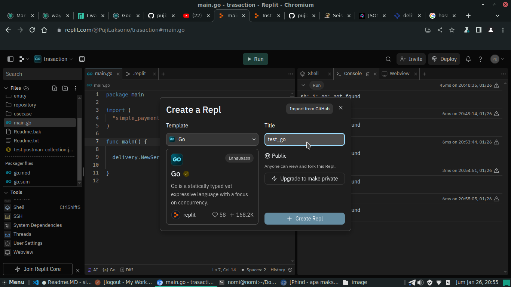
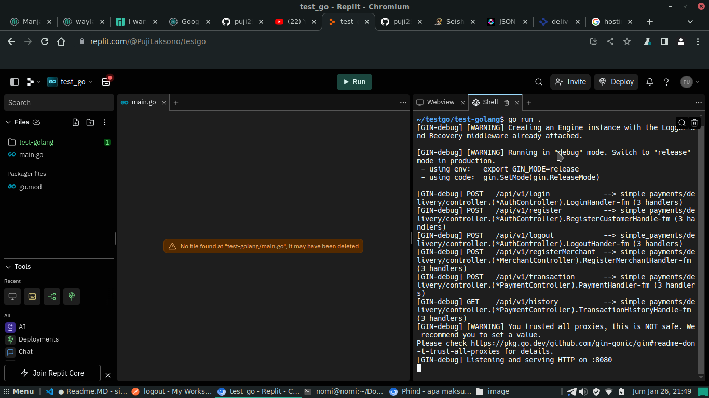

ini adalah api penghubung merchant dan bank. Dimana cara menjalankan dengan cara yakni :
    "go run ."
APi Memiliki beberap fitur diantarannya yakni :
1.	register : customer dapat register dengan mengakses localhost:8080/api/v1/register dipostman dan menginput body raw json berupa username dan password seperti digambar :
    

2.	login : customer dapat melakukan login dengan mengakses localhost:8080/api/v1/login dipostman dan menginput body raw json berupa username dan password seperti digambar :
    

3.	register merchant: merchant dapat melakukan register dengan mengakses localhost:8080/api/v1/registerMerchant dipostman dengan menginputkan body raw json berupa name dan password seperti digambar:
    

4.	transaction: customer dapat melakukan transaksi dengan mengakses localhost:8080/api/v1/transaction dipostman dengan menginputkan body raw json berupa from sebagai pengirim/customer, to sebagai penerima/merchant, dan amount atau nilai yang akan dikirim seperti digambar :
    

5.	history transaction: fitur untuk mendapatkan history transaksi yang dilakukan, dengan localhost:8080/api/v1/history seperti digambar :
    

6. logout : customer dapat melakukan logout akun dengan mengakses loclahost:8080/api/v1/logout di postman seperti di gambar :
    

DEPLOYMENT TO REPLIT

1. Login akun replit, jika belum maka registrasi.
2. Klik Create Repl di pojok kiri atas seperti digamabar ini :
   
3. Memilih template "GO", menulis tittle dan kemudian mengklik Create Repl.
4. Selanjutnya mengclone github di bagian shell seperti digambar :
   
5. lalu masuk ke directiry folder dengan perintah :
    cd nama-directory
6. setelah masuk ke directory jalankan perintah 
    "go run ." sperti digambar :
    

    