ini adalah api penghubung merchant dan bank. Dimana cara menjalankan dengan cara yakni :
    "go run ."
APi Memiliki beberap fitur diantarannya yakni :
1.	register : customer dapat register dengan mengakses localhost:8080/api/v1/register dipostman dan menginput body raw json berupa username dan password seperti digambar :
    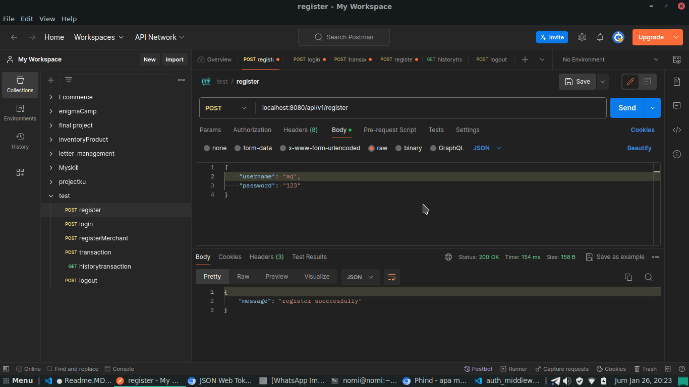

2.	login : customer dapat melakukan login dengan mengakses localhost:8080/api/v1/login dipostman dan menginput body raw json berupa username dan password seperti digambar :
    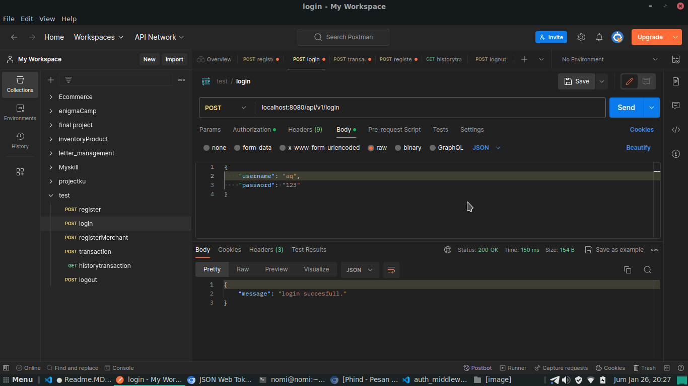

3.	register merchant: merchant dapat melakukan register dengan mengakses localhost:8080/api/v1/registerMerchant dipostman dengan menginputkan body raw json berupa name dan password seperti digambar:
    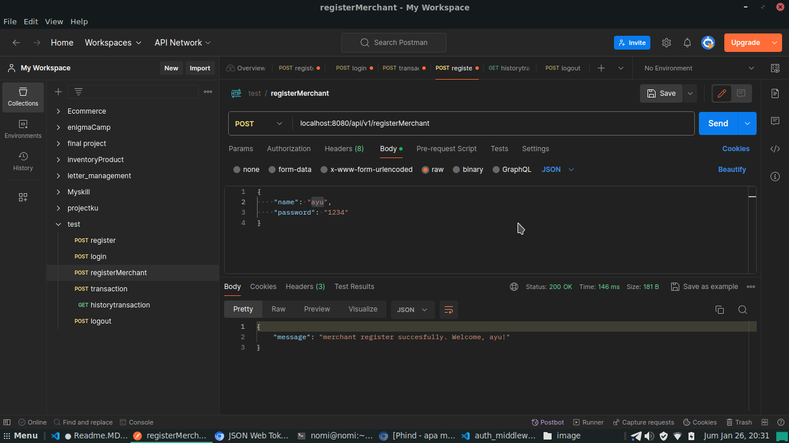

4.	transaction: customer dapat melakukan transaksi dengan mengakses localhost:8080/api/v1/transaction dipostman dengan menginputkan body raw json berupa from sebagai pengirim/customer, to sebagai penerima/merchant, dan amount atau nilai yang akan dikirim seperti digambar :
    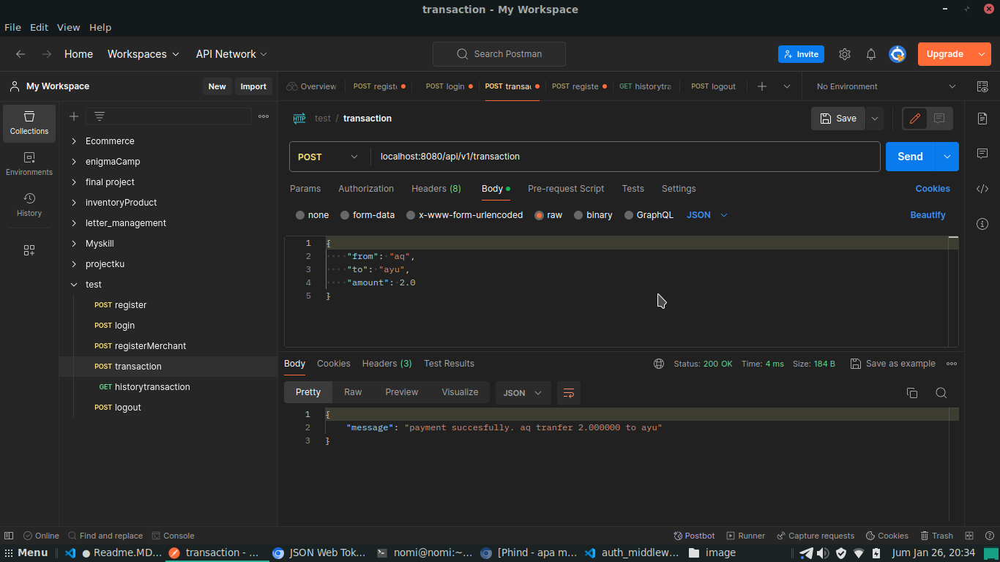

5.	history transaction: fitur untuk mendapatkan history transaksi yang dilakukan, dengan localhost:8080/api/v1/history seperti digambar :
    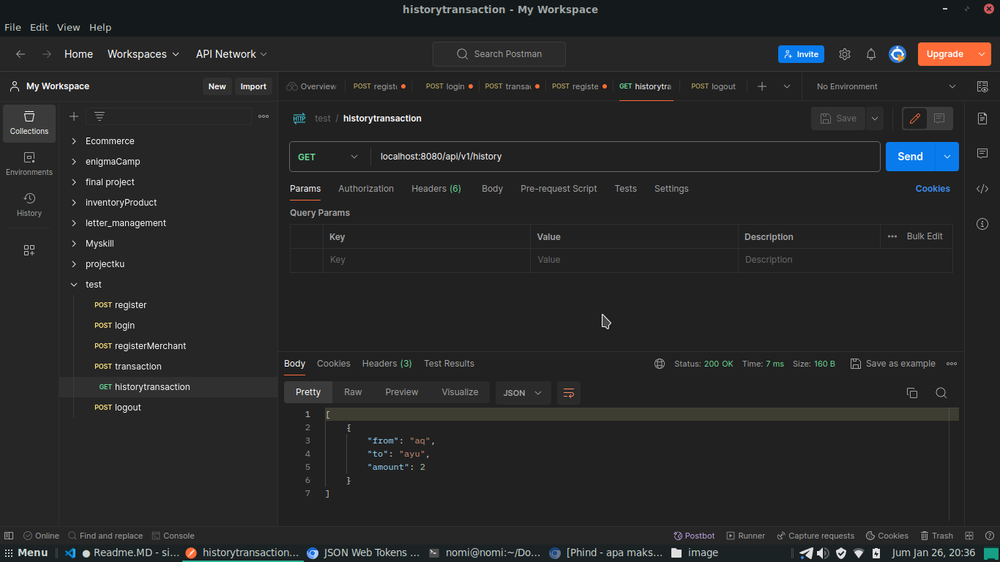

6. logout : customer dapat melakukan logout akun dengan mengakses loclahost:8080/api/v1/logout di postman seperti di gambar :
    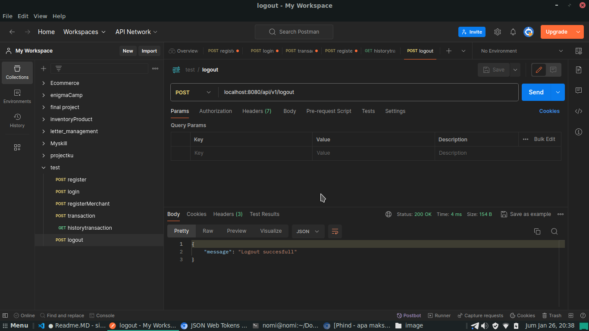

DEPLOYMENT TO RAILway.APP

1. Login akun raywails, jika belum maka registrasi.
2. Klik Deploy from repo seperti digamabar ini :
   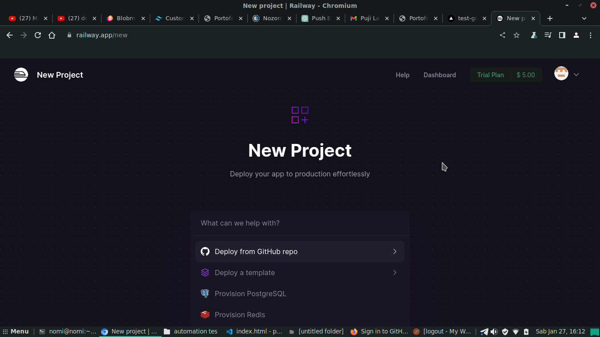
3. Klik Configuration GIthub App.
4. Selanjutnya pilih repository yang ingin dideploy seperti digambar :
   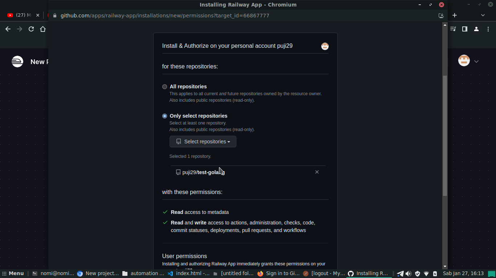
5. lalu klik initialize.
6. Setelah itu akan kembali ke menu awal trus klik deploy from repo lagi kemudian klik repositori seperti digambar ini :
    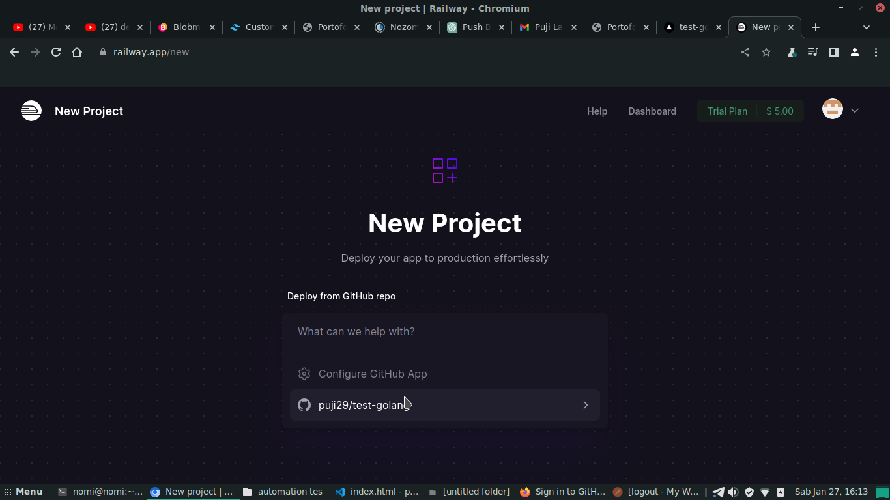
7. Klik Deploy Now seperti digambar :
  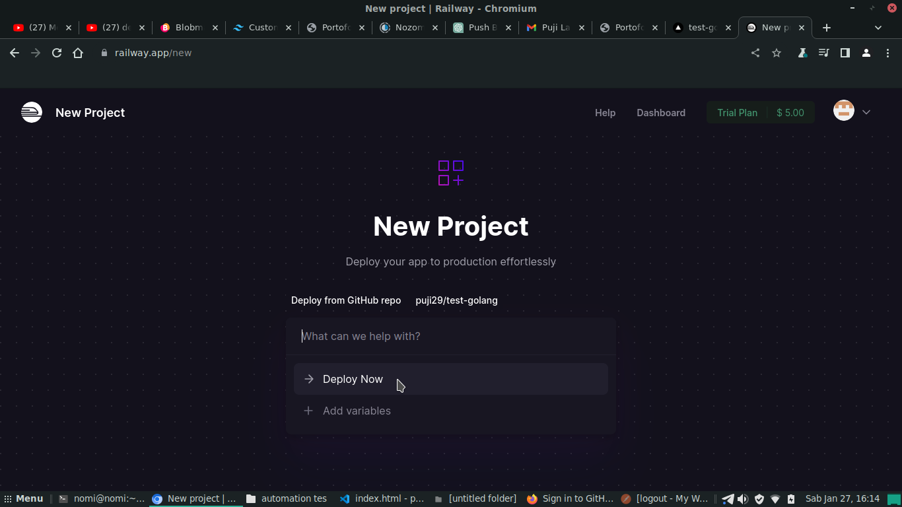
8. Selanjutnya menambahka variabel PORT dengan nilai 8080 seperti digambar :
   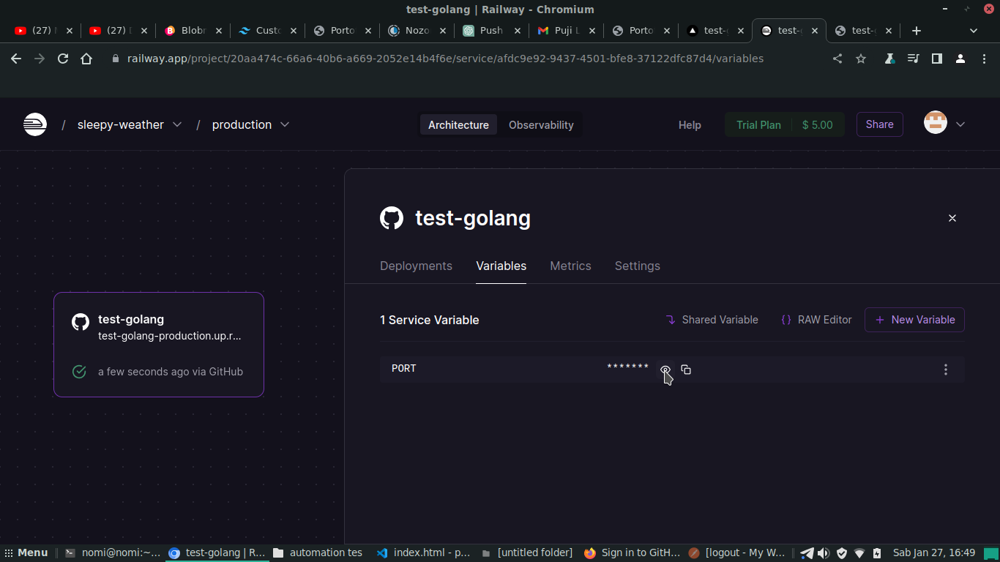
9. Tunggu proses hingga selesai seprti digambar :
    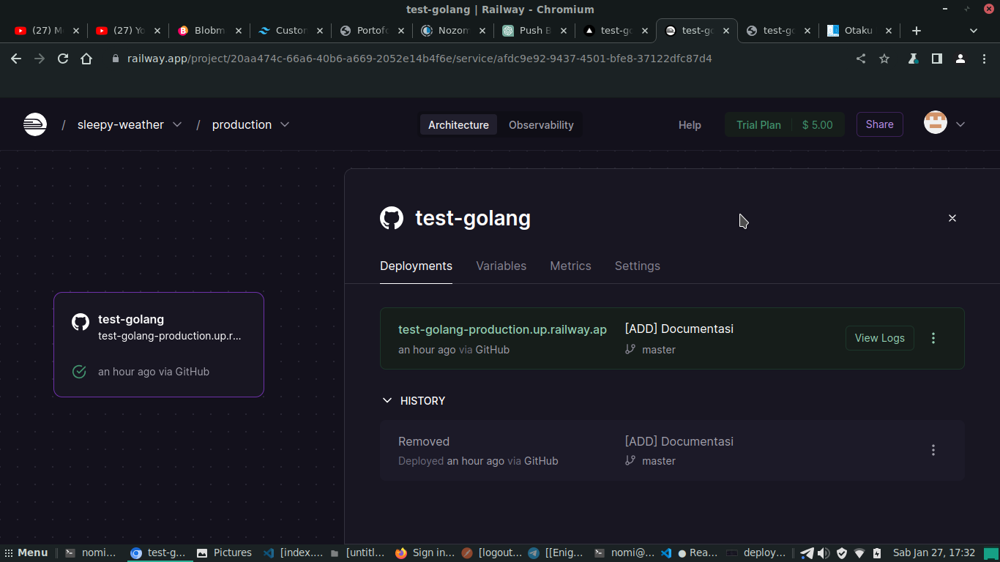

TEST DI POSTMAN 
1. Register :
   
2. Login :
   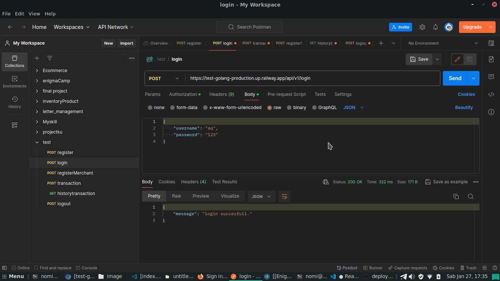
3. Register Merchant :
   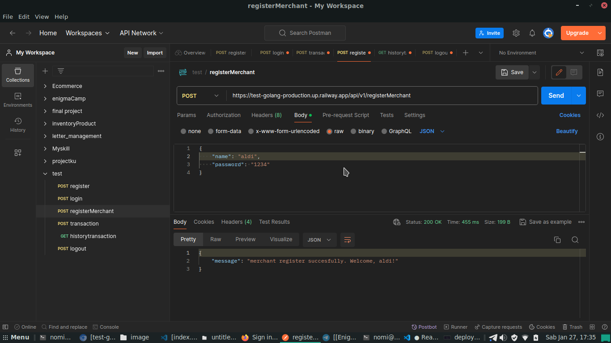
4. Transaction:
   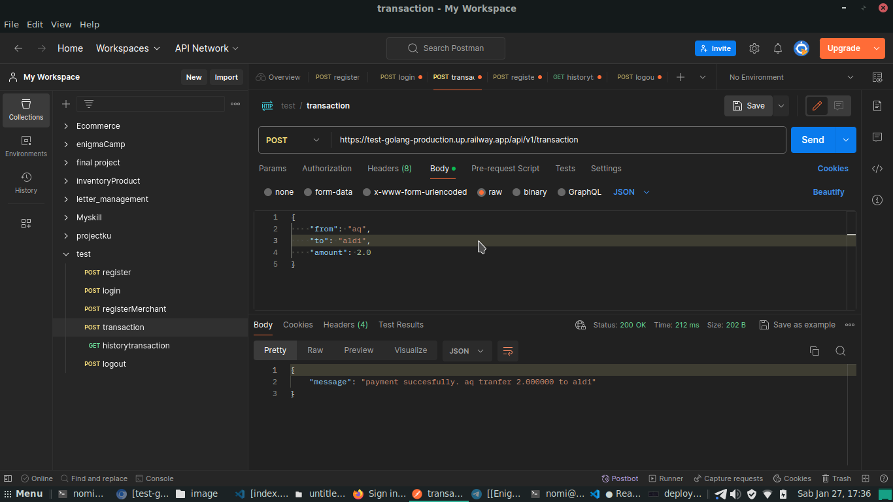
5. History:
   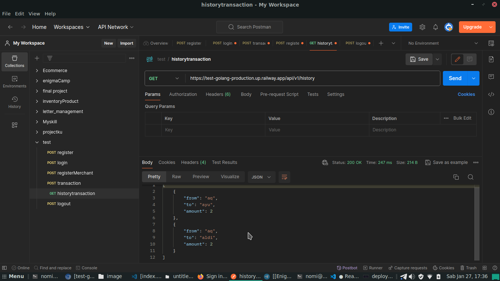
6. Logout :
   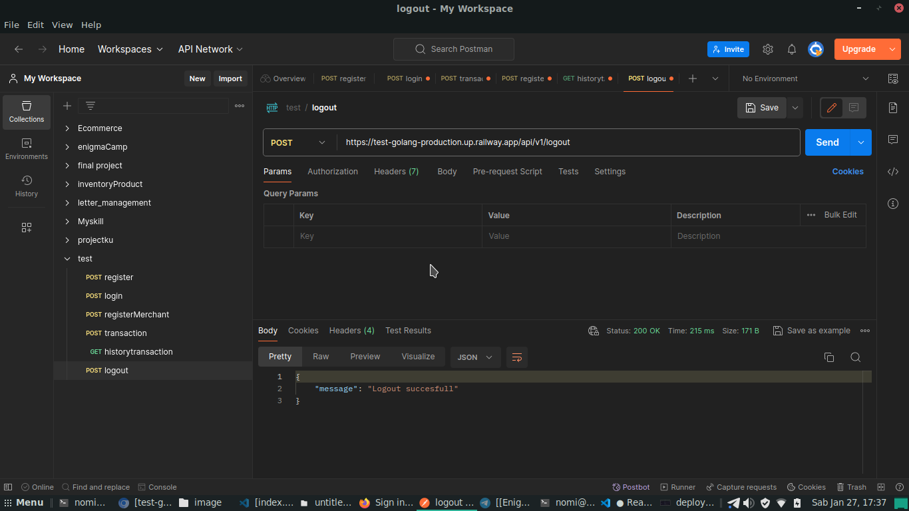

    